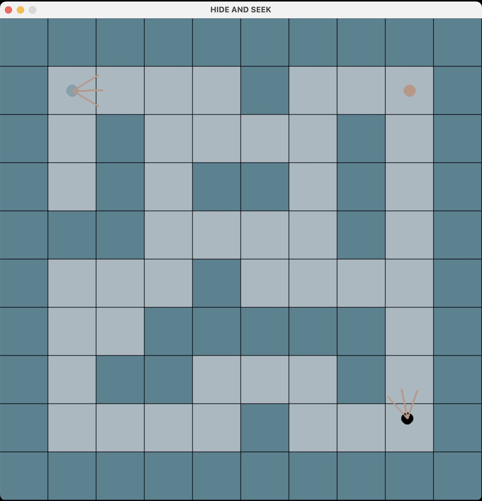
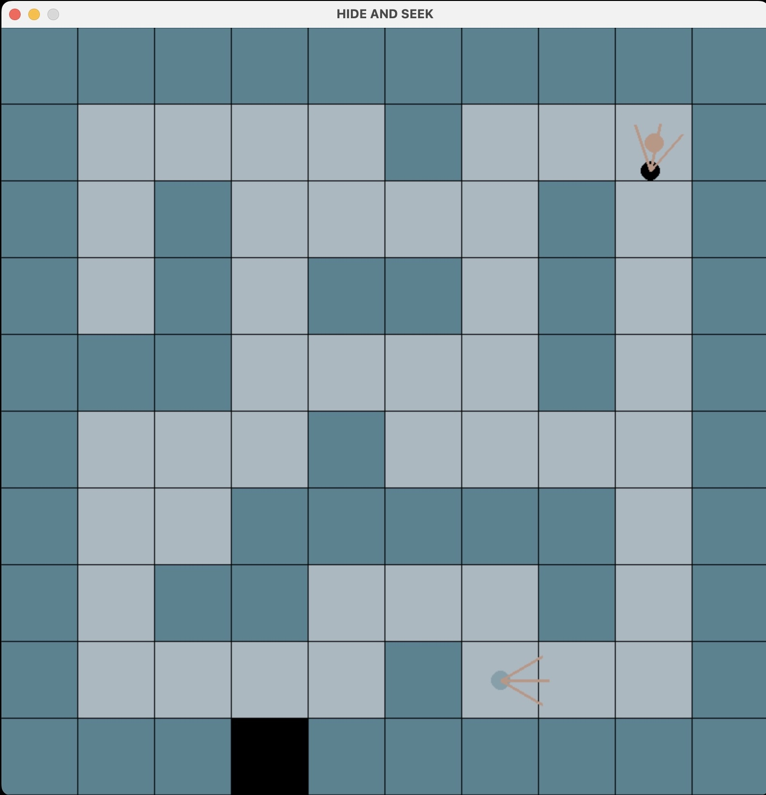
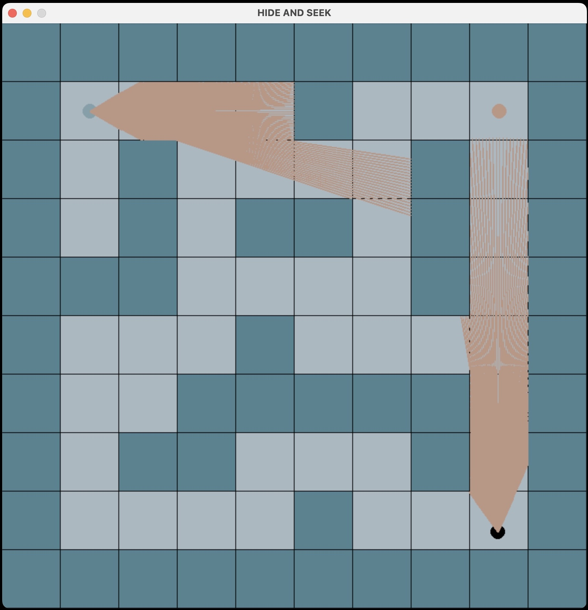
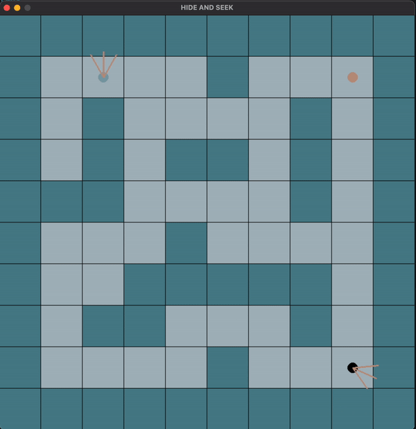
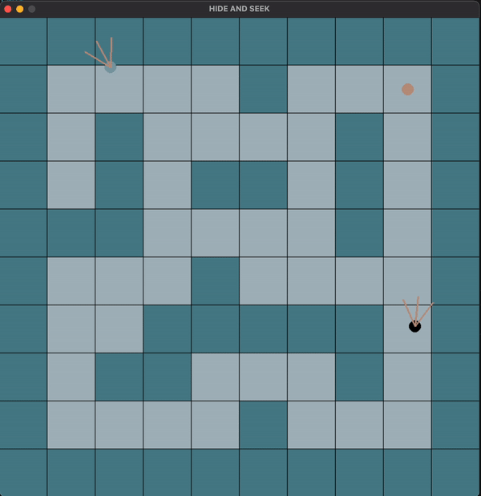
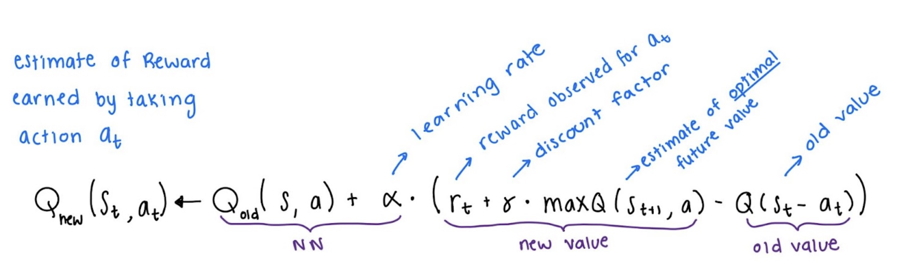
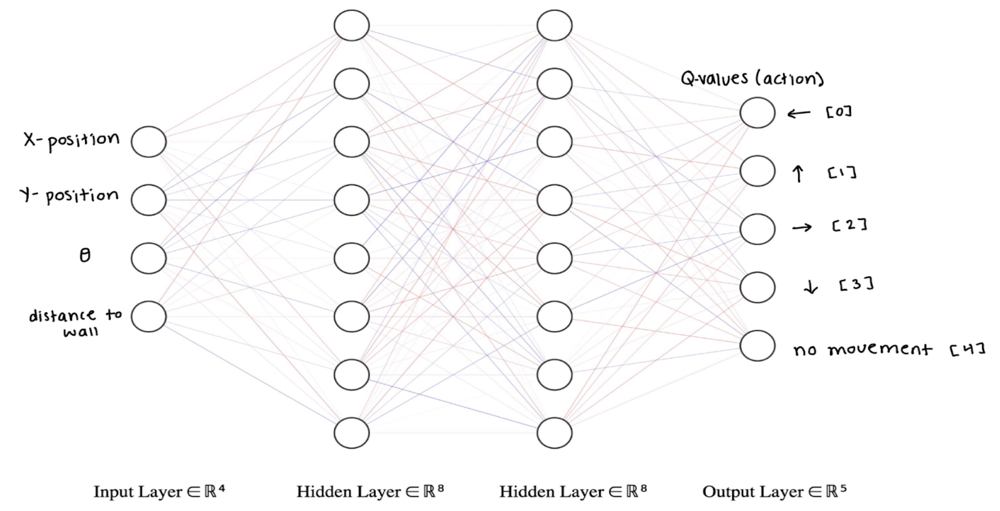

# hide-and-seek
With the growing popularity of reinforcement learning in areas such as game development, new frontiers have opened in the world of AI. This team set the goal to implement artificial intelligence in a hide and seek game. We designed and built the game from ground up using the Python and Pygame libraries.

This is the game of hide and seek combined with the game of capture the flag. There are two players hider and seeker. The objective of the hider is to capture the flag and then clear the map at the finish line without getting captured by the seeker. Much like the open AI implementation of this game, the team implemented a ray-casting algorithm which acts as a LIDAR system for navigation

We created the reinforcement learning agent by taking a Deep Q-Learning approach. Additionally, we designed and implemented a neural network to predict the Q-values using a player's state. The Q-values were then mapped to the actions possible for the agent at every given moment. The agent will then use the epsilon greedy method to take the best action possible while maintaining a degree of exploration. Over time the epsilon will decrease as the agent becomes more experienced with the environment. It is important to note that neither of the two agents has a broad knowledge of the map, and must learn this by the use of ray-casting and exploration.

## Game Dynamics
### Start Position
The players start from the oposite ends of the board. Dark blue tiles represent the walls that the players can not pass nor see through. The hider is the black player and the seeker is the light blue. The three lines indicate the direction and the filed of view of each player which in this case is set to equal. All of these parameters are adjustable. These lines are not the LIDAR system since it took extensive computing power to render each of the lines we turned them off during the training process.

### Hider has captured the flag
Here we see the hider has captured the flag and has opened the exit but the seeker has changed positions and the hider needs has no idea so through repetition it needs to be able to dodge the seeker. if the seeker steps inside the hider's field of view it will be detected by the hider but if the seeker is facing the hider then the hider will lose the game and get captured.

### Ray casting/LIDAR shown
Here we can see the LIDAR system working. each player can shoot 120 lasers which is then used to determine distance to the walls and other players or objects. For speed in training we turned off rendring and only indicate 3 short lines. it is important to note that the depth and the filed of view of each player is adjusted to demonstrate the LIDAR system, normally each player can roughly see 3 tiles radius.

## Results thus far

#### Early stages of training
In the early stages of training, between the 0th to 200th episodes, the players did not exhibit promising behaviors. Below is a pattern of behavior we observed in the 59th episode. The hider is rotating in place, which might not be the optimal behavior we are looking for, but this was a good sign because it showed that the hider is not nearing any walls. The policy included -2 points penalty for being close to walls to prevent wall-hugging and getting stuck. Based on this observation, we decided to slow down the epsilon decay process. In this episode, the epsilon is 0.02; since the epsilon is close to zero, the probability of the hider exploring the environment is very low.

#### Hider successfuly capturing the flag
In the early stages of training, between the 0th to 200th episodes, the players did not exhibit promising behaviors. Below is a pattern of behavior we observed in the 59th episode. The hider is rotating in place, which might not be the optimal behavior we are looking for, but this was a good sign because it showed that the hider is not nearing any walls. The policy included -2 points penalty for being close to walls to prevent wall-hugging and getting stuck. Based on this observation, we decided to slow down the epsilon decay process. In this episode, the epsilon is 0.02; since the epsilon is close to zero, the probability of the hider exploring the environment is very low.

## Q-Learning

## Neural Network Architecture
below shows the neural network with 4 inputs (x,y,theta, distance to the walls) but since then we have improved the neural network to recieve two additional inputs: 1. distance to the flag, 2. distance to the other player. Note that these prameters are only captured if the object or other player is in range/FOV of the player, otherwise the distance is inf the player is essentially unaware.

## Future Work
This project was more time-consuming and required much more training time than we had originally anticipated. Given more time, we plan to include the following improvements to the future generations of this model:
• integrate the seeker AI agent.
• Dedicate more time to training.
• Improving the code algorithms.
• Adjust policy rewards and penalties Fine tune the parameters fed into the model.

## Most important requirements 
- Python==3.8.13
- pygame==2.1.2
- tensorboard==2.8.0
- tensorboard-data-server==0.6.1
- tensorboard-plugin-wit==1.8.1
- tensorflow-macos==2.8.0
- tensorflow-metal==0.4.0

## References
#### you can access our [presentation here](https://docs.google.com/presentation/d/1KrOr5-LDAudpJNPdxdsBp3C2E04wXRxbL5YFA8u-bJM/edit?usp=sharing).
- [OpenAI - Emergent tool use from multi-agent interaction](https://openai.com/blog/emergent-tool-use/)
- [Keras - reinforcement learning](https://keras.io/examples/rl/deep_q_network_breakout/)
- [The emergence of Grounded Compositional Language in Multi-Agent Populations](https://www.semanticscholar.org/paper/Emergence-of-Grounded-Compositional-Language-in-Mordatch-Abbeel/5d2f5c2dc11c18c0d45203e2b980fe375a56d774)
